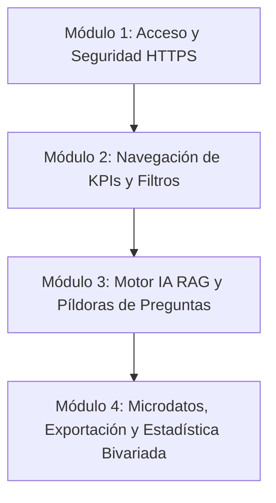

# 🎓 Plan de Capacitación Integral: Plataforma RAG Analítica para Tenderos del Norte del Tolima

Este documento establece el plan estructurado para capacitar al equipo académico de **Uniminuto**, encuestadores de campo y líderes comunitarios en la utilización de la nueva plataforma analítica segura (**React + FastAPI sobre HTTPS**).

---

## 🎯 1. Objetivos de la Capacitación

* **Apropiación Tecnológica:** Garantizar que los investigadores dominen la navegación, interpretación de KPIs y el uso del motor de Inteligencia Artificial (Gemini 2.5 Flash Lite).
* **Seguridad y Buenas Prácticas:** Instruir sobre el acceso seguro mediante sesiones protegidas (Cookies HttpOnly) y la privacidad de los microdatos.
* **Autonomía Analítica:** Capacitar en la realización de cruces bivariados, correlaciones de Spearman (15 dimensiones psicométricas) y exportación de reportes para artículos científicos o toma de decisiones en campo.

---

## 📚 2. Estructura Modular del Curso

### Módulo 1: Acceso y Seguridad de la Plataforma (1 Hora)
* **Arquitectura Segura:** Explicación de la conexión cifrada SSL/TLS (Puerto 443) y por qué no se requieren claves API manuales.
* **Ingreso al Sistema:** Uso de la contraseña unificada de acceso (`tolima2026`).
* **Gestión de Sesión:** Entendimiento de la expiración de sesiones (24 horas) y cierre seguro en equipos compartidos.

### Módulo 2: Exploración de KPIs y Filtrado Multidimensional (1.5 Horas)
* **Radiografía Demográfica:** Interpretación de las tarjetas de métricas principales (Muestra activa N=100, Porcentaje de Formalización, Resiliencia y Riesgo Promedio).
* **Filtrado Territorial y Socioeconómico:** Aplicación de filtros combinados por **Nodo de Significancia** (Lérida, Mariquita, Armero Guayabal), **Nivel Educativo**, **Estrato** y **Antigüedad del Negocio**.
* **Visualización Dinámica:** Análisis de las gráficas de distribución y promedios psicométricos.

### Módulo 3: Interacción con el Asistente IA RAG (2 Horas)
* **El Concepto RAG (Retrieval-Augmented Generation):** Cómo la IA consulta la base de datos local DuckDB para fundamentar sus respuestas en datos reales de los tenderos.
* **Uso de Píldoras de Sugerencia:** Práctica con los botones de preguntas rápidas (ej. *"¿Por qué los tenderos formalizados presentan mayor resiliencia en el Norte del Tolima?"*).
* **Ingeniería de Prompts Académicos:** Redacción de consignas complejas para contrastar marcos teóricos con la evidencia empírica local.

### Módulo 4: Analítica Avanzada y Gestión de Microdatos (1.5 Horas)
* **Diccionario de Datos:** Exploración del significado exacto de las 15 dimensiones psicométricas medidas en escala Likert (1-5).
* **Correlaciones y Bivariados:** Uso del módulo de correlación ordinal (Rho de Spearman) para demostrar relaciones entre dimensiones (ej. *Autonomía vs. Resiliencia*).
* **Exportación para Investigación:** Descarga de archivos CSV limpios y estandarizados para análisis en R, SPSS o anexos de manuscritos científicos.

---

## 🗓️ 3. Cronograma y Modalidad de Ejecución

| Sesión | Temática | Modalidad | Duración | Audiencia Objetivo |
| :---: | :--- | :---: | :---: | :--- |
| **Sesión 1** | Módulos 1 y 2 (Seguridad y KPIs) | Híbrida (Laboratorio Uniminuto / Virtual) | 2.5 Horas | Todo el equipo de investigación y tesistas |
| **Sesión 2** | Módulo 3 (Uso del Motor IA RAG) | Práctica en Laboratorio | 2.0 Horas | Analistas de datos, autores principales y coordinadores |
| **Sesión 3** | Módulo 4 (Estadística y Exportación) | Taller de Casos Reales | 1.5 Horas | Estadísticos, redactores de artículos e informes |
| **Sesión 4** | Clínica de Dudas y Evaluación Práctica | Presencial | 2.0 Horas | Todos los participantes |

---

## 💡 4. Preguntas Frecuentes (FAQ) para Capacitadores

> [!IMPORTANT]  
> **¿Qué ocurre si se aplica un filtro donde no hay registros (N=0)?**  
> El sistema está diseñado de forma robusta para no colapsar. La interfaz mostrará contadores en cero y el motor de IA indicará claramente que no hay muestra suficiente para emitir un juicio, manteniendo la rigurosidad analítica.

> [!TIP]  
> **¿Por qué se emplea Rho de Spearman en lugar de Pearson en los cruces bivariados?**  
> Porque las 15 dimensiones psicométricas (Autonomía, Creatividad, etc.) se recolectaron mediante escalas Likert (datos ordinales discretos de 1 a 5). Spearman es el estadígrafo exacto y riguroso para este tipo de distribución.

> [!NOTE]  
> **¿Cómo protege el sistema los datos sensibles de los tenderos?**  
> La base de datos local DuckDB no expone identificaciones personales, y la comunicación web viaja estrictamente por HTTPS cifrado con protección contra ataques CSRF y XSS.

---

## 🏆 5. Criterios de Evaluación y Certificación

Para acreditar la capacitación, los investigadores y estudiantes deberán:
1. Iniciar sesión exitosamente en el servidor HTTPS.
2. Aplicar una combinación de 3 filtros distintos (ej. *Nodo Mariquita + Formalizado + Bachiller*).
3. Generar una consulta IA personalizada y exportar el microdato correspondiente en CSV.
