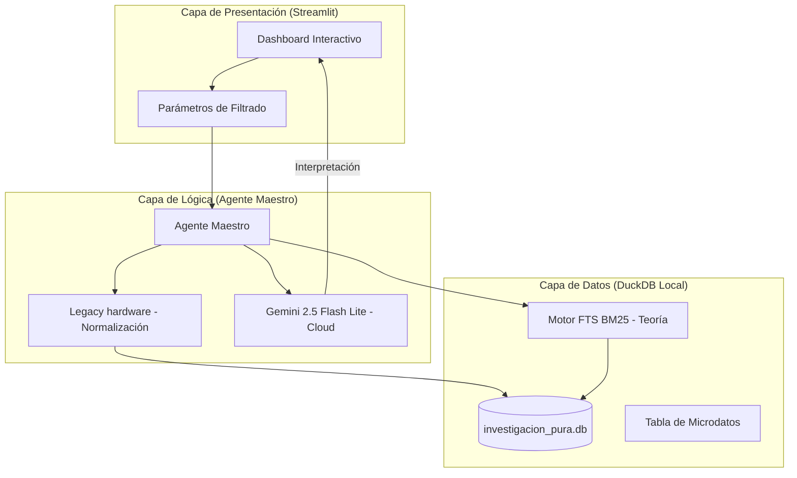

# Snapshot de Proyecto: Plan de Migración y Arquitectura RAG

Este documento actúa como una instantánea del estado actual del sistema de investigación, detallando la arquitectura, tecnologías y la estrategia de implementación adoptada para garantizar estabilidad en hardware legado.

## 1. Arquitectura del Sistema (Híbrida Nube-Local)

El sistema opera bajo un modelo **RAG (Retrieval-Augmented Generation)** optimizado para entornos con restricciones de hardware (procesadores antiguos sin soporte AVX).

---

## 2. Pila Tecnológica (Stack)

| Componente | Tecnología | Rol |
| :--- | :--- | :--- |
| **Interfaz (Frontend)** | **Streamlit** | Visualización de datos y sandbox de IA. |
| **Orquestación** | **LangChain** | Conexión entre el LLM y el motor de datos local. |
| **Cerebro (LLM)** | **Gemini 2.5 Flash Lite** | Interpretación de hallazgos (Dato-Contraste-Relevancia). |
| **Motor de Datos** | **DuckDB** | Almacenamiento local ultrarrápido y motor SQL. |
| **Búsqueda Semántica** | **BM25 (FTS)** | Búsqueda de teoría sin necesidad de vectores/AVX. |
| **Gráficos** | **Plotly Express** | Visualización de perfiles psicométricos y correlaciones. |

---

## 3. Estrategia de Implementación (Plan D)

Debido a la ausencia de instrucciones AVX en el hardware de destino (Sandy Bridge), se ha migrado de una arquitectura pesada a una **Arquitectura Resiliente (Plan D)**:

1.  **Eliminación de Ollama/Chroma**: Se descartó la ejecución local de modelos y bases de datos vectoriales que requerían AVX o alto consumo de RAM.
2.  **Motor SQL Robusto**: Uso de DuckDB para crear la **"Legacy hardware"**, un mapeo 1:1 que normaliza 15 dimensiones psicométricas y demográficas en tiempo real.
3.  **Búsqueda de Teoría con FTS**: En lugar de embeddings vectoriales, se utiliza el motor de **Full-Text Search (BM25)** nativo de DuckDB para recuperar fragmentos teóricos relevantes.
4.  **Inferencia en la Nube**: El procesamiento de lenguaje natural se delega a Gemini para liberar la carga computacional local.

---

## 4. Estructura de Datos: La "Legacy hardware"

El sistema normaliza los datos en una vista centralizada que alimenta tanto al Dashboard como al Agente Maestro:

*   **Nodos Territoriales**: Lérida, Mariquita, Armero Guayabal.
*   **Variables de Formalización**: Clasificación binaria (Formalizado/No).
*   **15 Dimensiones Psicométricas**: Autonomía, Resiliencia, Creatividad, Gestión de Riesgo, etc. (Escala Likert 1-5).

---

## 5. Estado de la Migración

- [x] Migración de Ollama a Gemini 2.5 Flash.
- [x] Reemplazo de ChromaDB por DuckDB FTS (BM25).
- [x] Implementación de 'Legacy hardware' en DuckDB.
- [x] Dashboard Streamlit con filtros dinámicos.
- [ ] Refinamiento de prompts de interpretación senior.
- [ ] Optimización de reportes automáticos en PDF.

---

> [!NOTE]
> Esta configuración garantiza que el sistema pueda ejecutarse en equipos con procesadores de segunda generación (Intel Sandy Bridge) manteniendo la potencia de análisis de un LLM de última generación.
